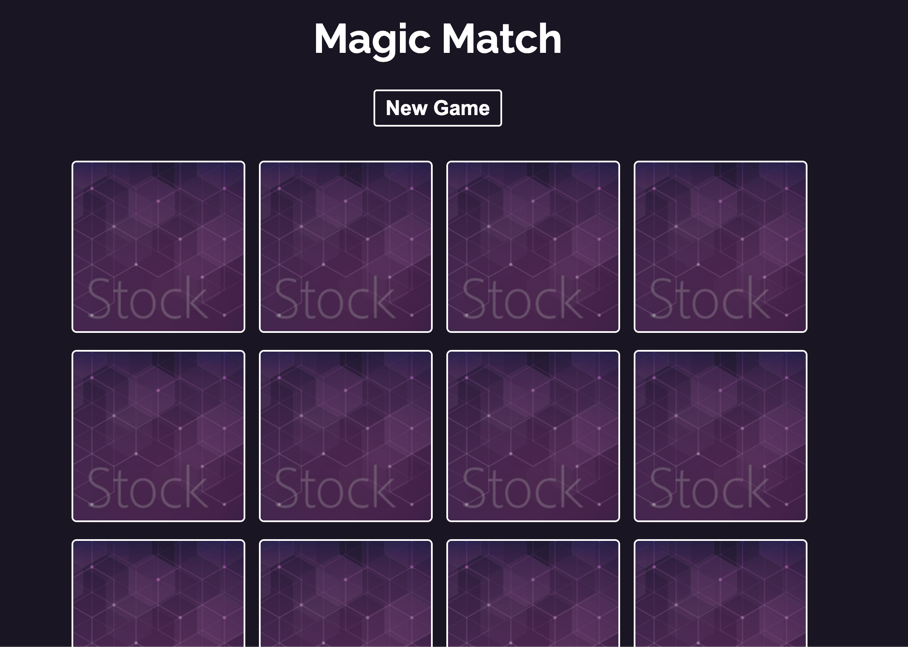

# Magic-Memory

Create a Memory Game from React.  
Enjoy and have fun !

## Getting Started

### Prerequisite

- Download [Node.js](https://nodejs.org/zh-tw/download/)
- Clone the files and use `npm init` to setup the prerequisite for this project

### Run on the browser

- Runs the app in the development mode with `npm start`

- Open [http://localhost:3000](http://localhost:3000) to view it in the browser.

## Learn More

Check out the live project [(Github Pages)](https://pages.github.com) by clicking [Magic-Memory](https://michael861227.github.io/Magic-Memory/)

If you don't know how to deploy a react app to Github Pages, you can go visiting [Deploying a React App to GitHub Pages](https://github.com/gitname/react-gh-pages) , it shows you how you can create a React app and deploy it to GitHub Pages.

To learn React, check out the [React documentation](https://reactjs.org/).

Project: [Make a Memory Game with React](https://www.youtube.com/watch?v=ZCKohZwGZMw&list=PL4cUxeGkcC9iQ7g2eoNXHCJBBBz40S_Lm)
